# App Connect Enterprise 12.0.5.0-r2 with ITX 10.1 & UserExits on CP4I

## Overview
This repo showcases how to run a custom IBM ACE (App Connect Enterprise) container with ITX on OCP.  This documentation is designed to demonstrate how to lift & shift bar files for ACE flows running on-premises and seamlessly deploy them on OCP's Cloud Pak for Integration.  

Baking ITX into the ACE container optimizes runtime performance for ACE flows that leverage ITX while also avoiding any need to modify the original flow to function on OCP.


This repo includes the following:

- A custom Docker file which combines IBM's supported ACE Container with ITX, its needed dependencies for ACE 12, and configuration for running User Exit
- A demo tutorial for running a basic ACE flow including a test ToUpperCase() ITX map on OCP
- Fully built out config maps for deploying ACE integration servers on CP4I without further customization required

*******************************************************************************************************************************************************************

## Environment

- IBM ROKS (VPC Gen2 with ODF) v4.10 [3 nodes x 16CPU/64GB]
- IBM Cloud Pak for Integration 6.0.4 Operator w/ Platform UI 2022.2.1 instance
- IBM App Connect 5.1.0 Operator w/ Quickstart Dashboard instance
- IBM MQ 2.1.0 Operator
- IBM Sterling Transformation Extender Runtime and Monitoring V10.1.1 Linux x86 Multilingual (Part number `M0519ML`)
- [OpenShift CLI](https://docs.openshift.com/container-platform/4.10/cli_reference/openshift_cli/getting-started-cli.html)

*All operators and instances were deployed to the `cp4i` namespace*  
*All terminal commands below are to be executed from the root of the repo*  

*******************************************************************************************************************************************************************

## Deployment Steps

### 1. Building `IntegrationServer` custom image  

#### Option 1 - Using the Build capability of OpenShift  

<br>

> If using this option make sure you have the proper credentials in place for github & ibm cloud pak image repository.  
> Update github-credentials in the yaml directory & create the secret  
> ``` 
> oc create -f yaml/github-credentials.yaml
> ```
> 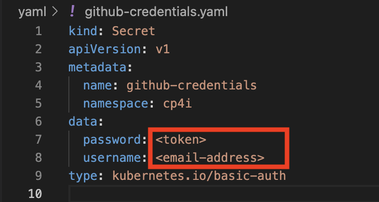
> 
> Create ibm-entitlement-key secret
>  ```
>  oc create secret docker-registry ibm-entitlement-key \ 
>    --docker-username=cp \ 
>    --docker-password=<entitlement_key> \
>    --docker-server=cp.icr.io \
>    --namespace=cp4i
>  ```
> 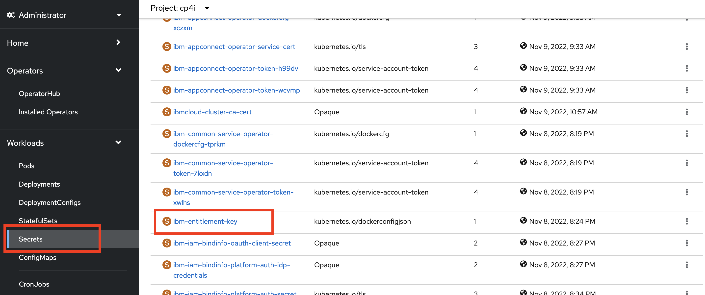 

<br>

**a. Create ImageStream resource to store built images**  
  ```
  oc create -f yaml/ImageStream.yaml  
  ```
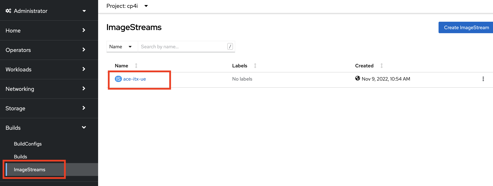

<br>

**b. Create BuildConfig resource to build image**  
  Update ITX_URL in yaml/BuildConfig.yaml (make sure you get the bundle with the correct part number, see Environment section)
  ```
  oc create -f yaml/BuildConfig.yaml
  ```  
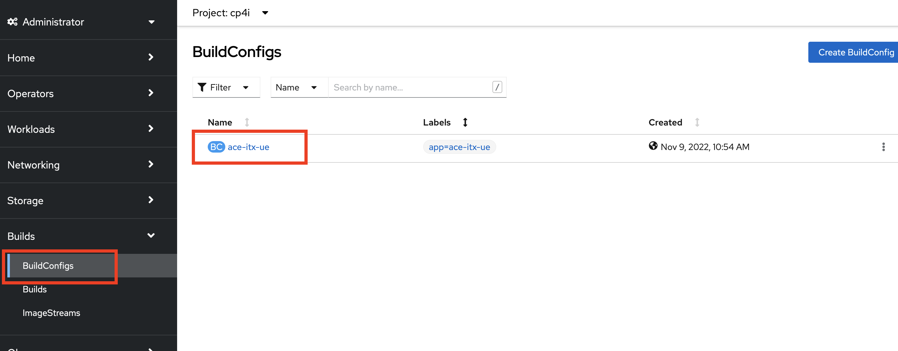

<br>

**c. Build image**  
  ```
  oc start-build ace-itx-ue
  ```
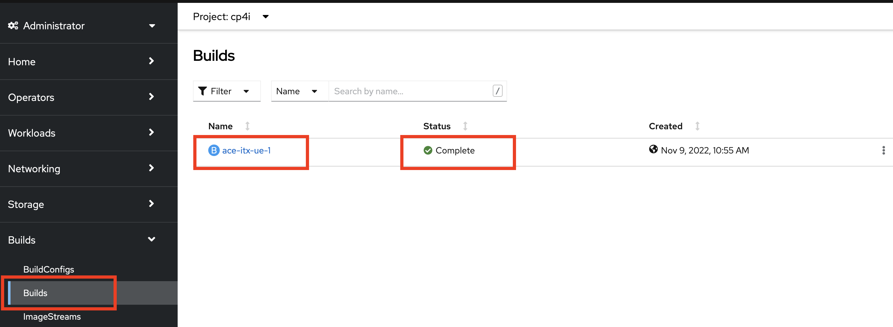

#### Option 2 - Building custom image locally

a. Download ITX 10.1 Runtime & Monitoring bundle & unpack to `itx` directory  
b. Open `itx/wmqi/dtxwmqi.sh` file & replace `%REPLACE_TXHOMEDIR%` with `/opt/ibm/itx`  
c. Build image with Podman/Docker using Dockerfile  
d. Upload image to a repository  

<br>

*******************************************************************************************************************************************************************

### 2. Configuring IBM MQ  

**a. Create a ConfigMap that contains the queue manager & queue parameters**  
  ```
  oc create -f yaml/ConfigMap.yaml
  ```  
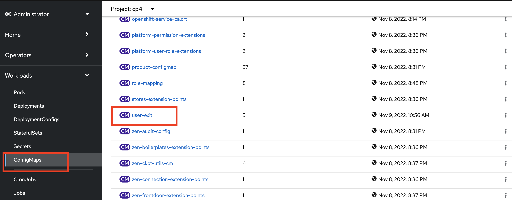

<br>

**b. Deploy Queue Manager instance**  
  ```
  oc create -f yaml/QueueManager.yaml
  ```  
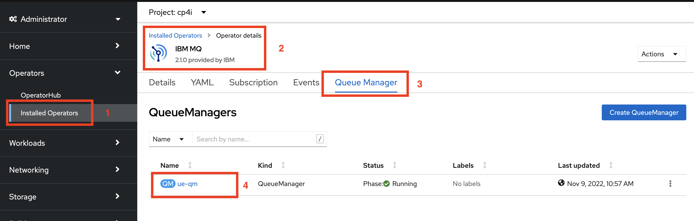

*******************************************************************************************************************************************************************

### 3. Storing ITX map in a `PersistentVolume`  

<br>

**a. Create `PersistentVolumeClaim` to reserve storage**  
  ```
  oc create -f yaml/PersistentVolumeClaim.yaml
  ```  
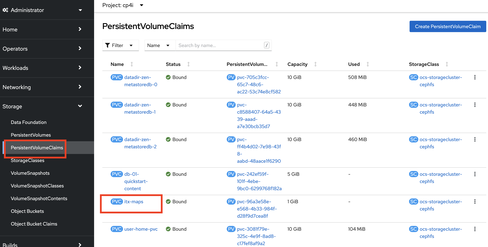

<br>

**b. Deploy `Pod` to upload ITX map to `PersistentVolume`**  
  ```
  oc create -f yaml/Pod.yaml
  ```  
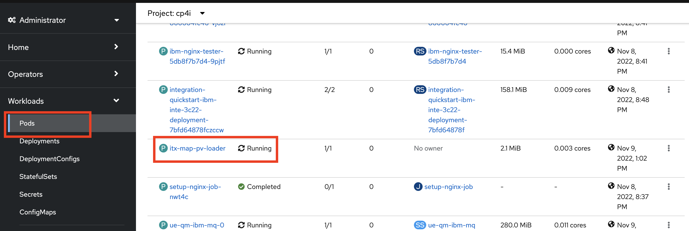

<br>

**c. Copy ITX map to `PersistentVolume`**  
  ```
  oc cp test-files/Test.lnx itx-map-pv-loader:/maps
  ```  
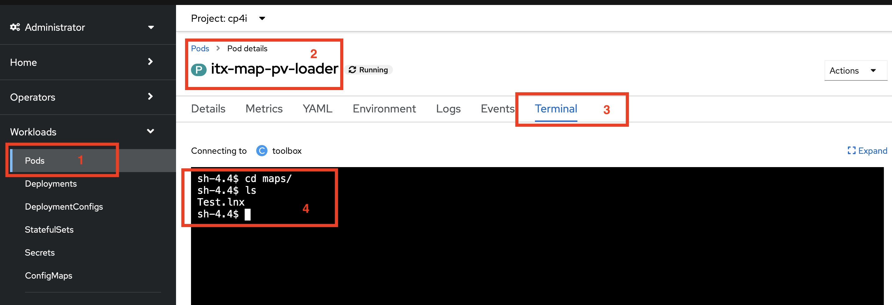

<br>

*******************************************************************************************************************************************************************

### 4. Instantiating the `IntegrationServer`  

The following steps are to be taken in the OpenShift Console GUI & CP4I GUI  

**a. Obtain Platform Navigator URL**  
Navigate to Operators -> Installed Operators -> IBM Cloud Pak for Integration -> Platform UI -> integration-quickstart 
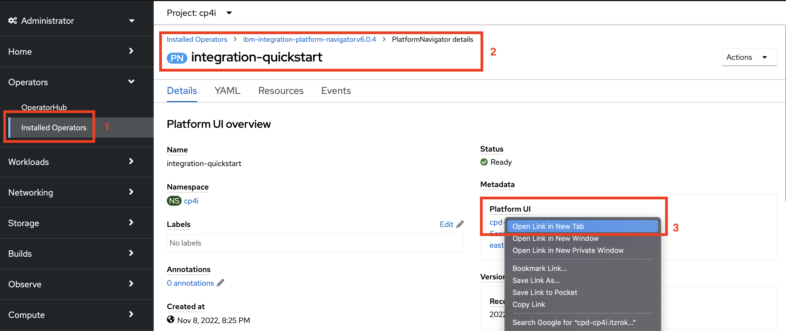

<br>

**b. Obtain admin credentials**  
Navigate to Workloads -> Secrets -> ibm-iam-bindinfo-platform-auth-idp-credentials
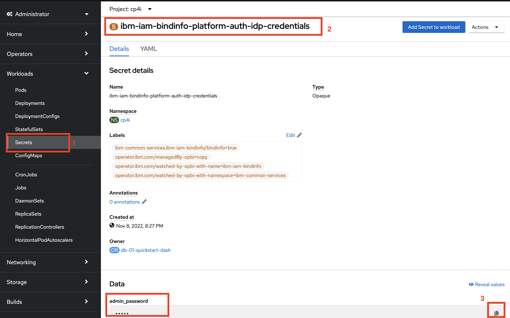

<br>

**c. Login to CP4I PlatformNavigator and open the App Connect Dashboard (should be named `db-01-quickstart`)**  
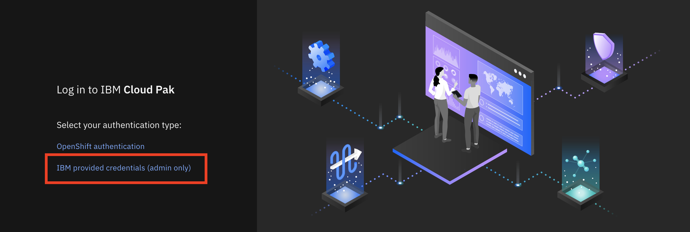

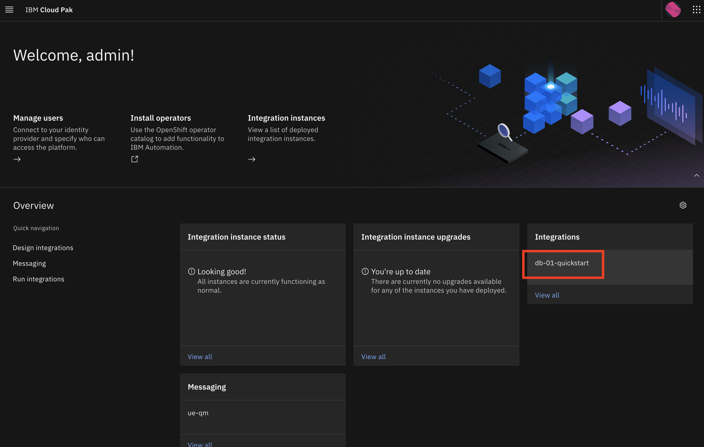

<br>

**d. On the left bar pane select Configuration**  
  

<br>

**e. Create configuration**  
  

<br>

**f. Select type server.conf.yaml**  

**g. Import file from yaml directory**  

**h. Change name to `user-exit` & create**  

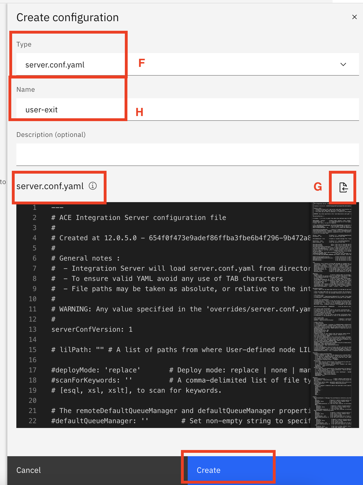

<br>

**i. On the left bar pane select BAR files**  


<br>

**j. Import External_ITX_Map.bar from test-files directory**  
  

<br>

**k. Click on breadcrumbs, select Display BAR URL & copy URL**  
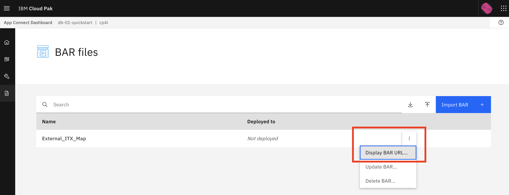

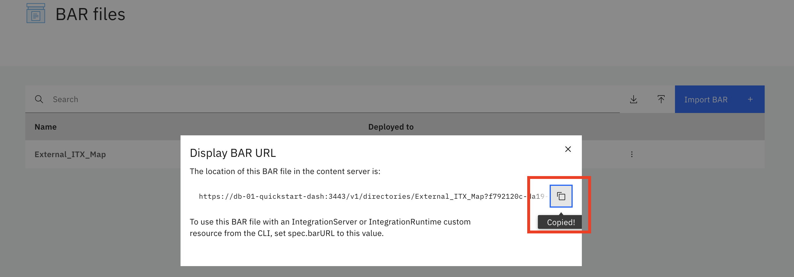

<br>

**l. Update barURL in yaml/IntegrationServer.yaml (line 62)**  

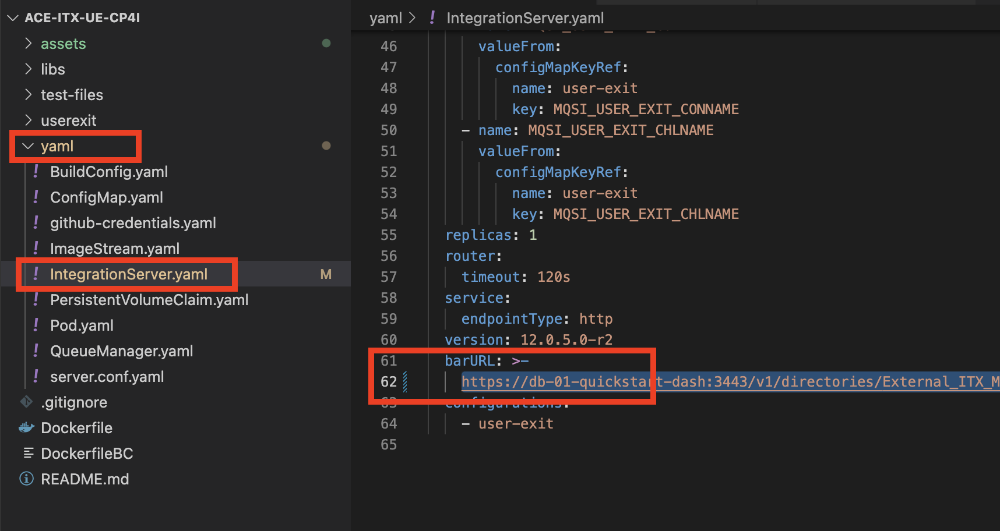

<br>

**m. Create `IntegrationServer`**  
  ```
  oc create -f yaml/IntegrationServer.yaml
  ```
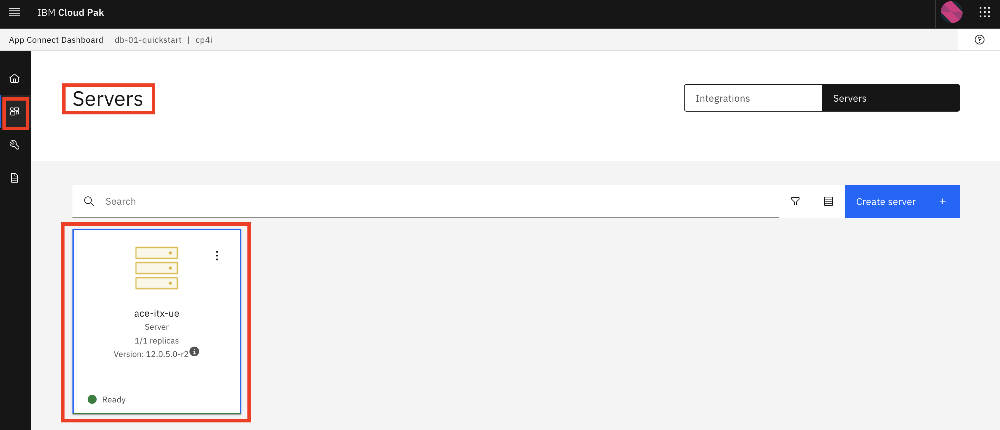

<br>

*******************************************************************************************************************************************************************

### 5. Testing  

**a. Start ITX flow**  
Select the `ace-itx-ue` Server Tile -> `ACE_ITX_Container_Test` Application Tile -> click breadcrumb for `ITX_FILE_Docker` and select `Setup` (*note: ignore error*) -> click breadcrumb for `ITX_FILE_Docker` and select `Start`
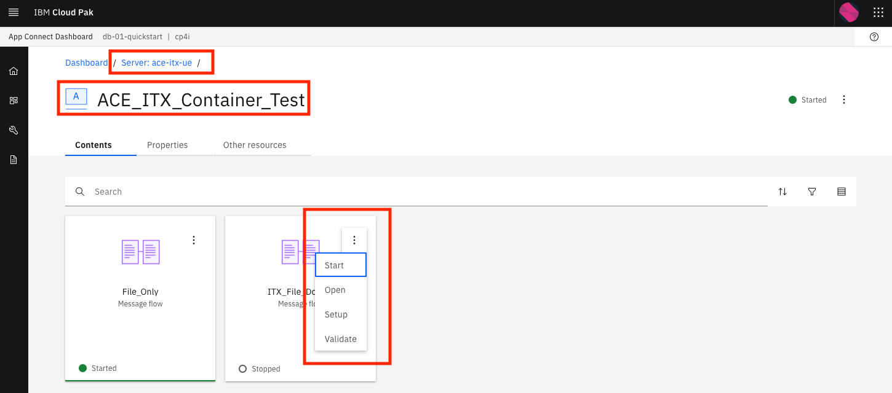

<br>

**b. Log into terminal**  
In OCP, open Pod `ace-itx-ue-is-...` and select `Terminal` tab  

<br>

**c. Run test**  
  Change directory to `cd /home/aceuser/data/file_in` -> create test file `echo "test map" > test.txt` -> change directory to `cd /home/aceuser/data/file_out` -> confirm transformation is successful `cat ITX_output.txt`

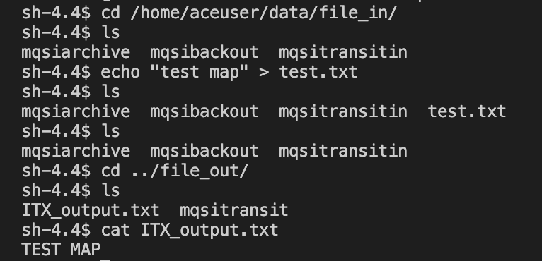
